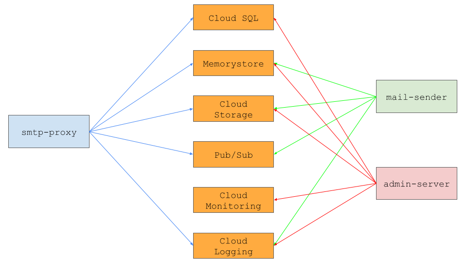
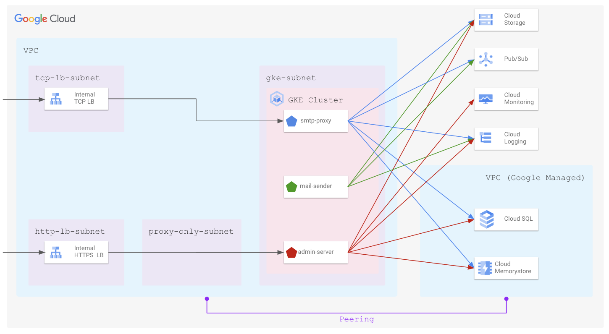

# Components

* smtp-server:
  - description: [smtp](https://www.rfc-editor.org/rfc/rfc5321) server to receive mails
  - protcol: smtp

* admin-server:
  - description: HTTP/HTTPS server for administration
  - protocol: http/https

* mail-sender
  - description: background service to relay mail received by `smtp-server`

# GCP Services

* Cloud SQL: database for `credentials` of smtp users.
* Cloud Memorystore (Redis): in-memory cache for smtp stats.
* Cloud Monitoring: store metrics of smtp.
* Cloud Logging: store logging of key components.
* Pub/Sub: store mails received by `smtp-server`, and `mail-sender` will pull mails from Pub/Sub and relay mails based on configuration.
* Cloud Storage: object store to save configurations for key components.

# Dependencies between Components

# System Architecture

